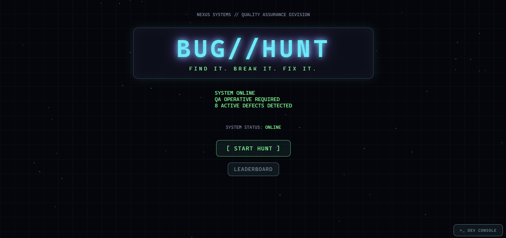
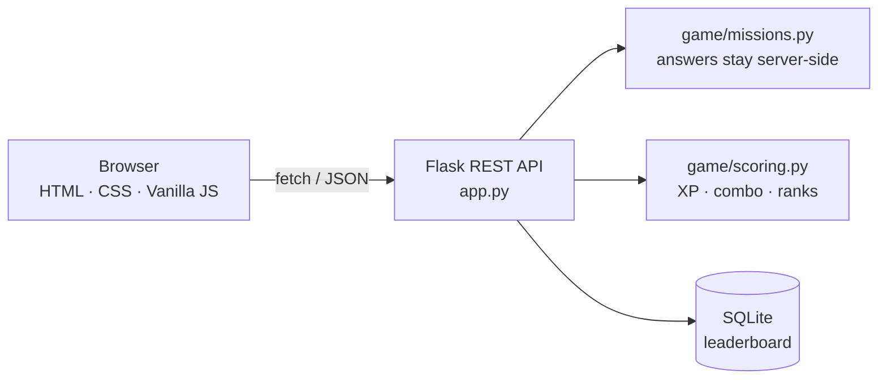

<div align="center">

# 🐞 BUG//HUNT

### `FIND IT. BREAK IT. FIX IT.`

**A cyberpunk software-testing mini-game. You are a junior QA operative at NEXUS SYSTEMS, and 8 broken apps need your diagnosis.**


### [▶ PLAY THE DEMO](https://bug-hunt-jff8.onrender.com/)



</div>

---

## 🎮 What is it?

Most testing projects are dashboards. **BUG//HUNT is a game.** Each mission hands you a small broken application (a login, an API response, a calculator, a form, a state machine…). You poke at it, work out what is wrong, then file a real defect report:

| You choose | Example |
|---|---|
| **Bug category** | Security, Validation, Logic, API, Data, UI, State Management, Performance |
| **Severity** | Low, Medium, High, Critical |
| **Diagnosis** | *"Login accepts an empty password; it should be denied."* |

The **Flask backend** judges your report, awards XP, and decides if you lose a life.

## 🗺️ Missions

| # | Mission | What you test |
|---|---|---|
| 01 | Broken Login | authentication edge cases |
| 02 | API Hunter | HTTP status vs response body |
| 03 | Zero Division | calculator edge case |
| 04 | Form Failure | hidden validation gaps |
| 05 | State Machine | illegal state transitions |
| 06 | Data Validator | wrong types, empty and negative values |
| 07 | UI Ghost Bug | behaviour you have to reproduce |
| 08 | The Final Defect | several defects combined |

## ⭐ Scoring

```
Base 100 + Category 100 + Severity 100 + Diagnosis (up to 150) + Speed (up to 50) + Perfect 100
                                    ↓
                               XP earned  ×  Combo (x1 → x5)  =  Score
```

Ranks: `ROOKIE` → `BUG SCOUT` → `BUG HUNTER` → `QA OPERATIVE` → `DEFECT MASTER`.
You have 3 lives, and retrying after a failure costs XP.

## 💡 Why this project is different

- **Learn testing by doing.** Boundary values, negative testing, HTTP semantics and state transitions become gameplay.
- **Fair scoring.** Diagnosis is matched by concepts and synonyms, not exact strings, so you can describe a bug in your own words.
- **Works on desktop, tablet and phone.** Responsive layout, keyboard-accessible controls, visible focus states.
- **Built-in Dev Console.** Live API logs show what the app is doing, like browser DevTools.
- **Cheat-resistant by design.** The server owns the truth (see below).

## 🧠 How it works



**Anti-cheat and backend validation**
- Scores, XP, lives and combo live in a **signed server-side session**, never in the browser.
- Sending `{"score": 999999}` does nothing. Extra fields are ignored (covered by a test).
- Mission answers are **never sent to the client**.
- Mission timing is **measured on the server**.
- Player names are validated, SQL is parameterized, and the leaderboard only accepts finished runs.

## 🧪 Testing strategy

**57 pytest tests** run against the real Flask app using its test client, with a fresh temp database per test.

| Area | What is verified |
|---|---|
| Health and routing | `/api/health`, JSON 404s and 405s, page served |
| Missions | all 8 load, invalid, negative and non-numeric IDs, no answer leakage |
| Submission | correct, partial and wrong answers, lives, game over, retry cost, combo, speed bonus |
| Scoring | rank boundaries, combo cap, diagnosis matching (unit tests) |
| Leaderboard | name validation (empty, too long, HTML, SQL-like, blocked), duplicate and early submission |
| Invalid input | non-JSON body, wrong types, bad enums, oversized text, injected score fields |

```bash
pytest
```

## 🚀 Run it locally

```bash
git clone https://github.com/Ishaan-1767/BUG-HUNT.git
cd BUG-HUNT

python -m venv venv
venv\Scripts\activate          # macOS/Linux: source venv/bin/activate

pip install -r requirements.txt
python app.py
```

Open **http://127.0.0.1:5000**. The database is created automatically.

## 🔌 API

| Method | Endpoint | Purpose |
|---|---|---|
| GET | `/api/health` | liveness check |
| GET | `/api/game/missions` | mission list and options |
| GET | `/api/game/mission/<id>` | public mission data |
| POST | `/api/game/mission/<id>/start` | start the server-side timer |
| POST | `/api/game/mission/<id>/submit` | submit `{category, severity, diagnosis}` |
| GET | `/api/game/state` | current run summary |
| POST | `/api/game/reset` · `/api/game/retry` | new run · restore lives (costs XP) |
| GET | `/api/leaderboard` | top 10 by XP |
| POST | `/api/leaderboard` | save score (`{name}`, finished runs only) |

## 📁 Project structure

```
BUG-HUNT/
├── app.py               Flask app factory and routes
├── wsgi.py              production entry point
├── game/
│   ├── missions.py      mission data (answers stay server-side)
│   ├── scoring.py       XP, combo, ranks, diagnosis matching
│   └── leaderboard.py   SQLite + name validation
├── tests/               pytest suite
├── templates/           index.html
└── static/              css/ and js/ (api, animations, game, app)
```

## 🔭 Future improvements

More missions and difficulty levels · user accounts · hosted global leaderboard · Playwright UI tests · GitHub Actions CI/CD · GenAI-generated test cases.

## 👤 Author

Built by **Ishaan Singh** as a portfolio project for SDET roles.
[GitHub](https://github.com/Ishaan-1767) · [LinkedIn](www.linkedin.com/in/ishaansingh18)

---

<div align="center"><sub>NEXUS SYSTEMS · QUALITY ASSURANCE DIVISION · SYSTEM ONLINE</sub></div>
